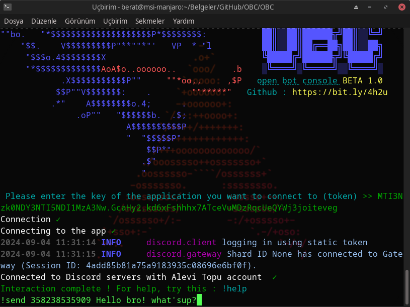

# OBC
OpenBotConsole software allows you to connect to your bot and control it through a console
# Requirements
> ### intents
> - PRESENCE INTENT
> - SERVER MEMBERS INTENT
> - MESSAGE CONTENT INTENT

> ### libraries
> - discord
> - requests
> - colorama
# Setup
 
> ### Windows
> - Download project files from your web browser or git windows client
> - If your libraries are missing, use this : `pip install -r requirements.txt`
> - Start the program using `python main.py` or `python main.py <token>`
> - If you did not specify your token as an argument at startup (`python main.py <token>`), enter your token in the input asked at startup

> ### Linux
> - use `git clone https://github.com/berhatpasha/OBC`
> - Enter the directory with the `cd OBC` command
> - Start the software with `python3 main.py` or `python3 main.py <token>`
> - If you did not specify a token when starting the software (`python3 main.py can be used as <token>`) connect to your bot by entering your token on the first login

# Using
> If you need help, just use the `!help` command. In addition, this chapter explains the detailed use of commands and what they mean.
> When you use the `!help` command you will get the following (or equivalent) ::
> 
> `!send <channelId> <message>
!monitoringMode (does not take arguments)
!emergencyMode (does not take arguments)
!ban <userID>
!kick <userID>
!mute <userID> <duration (in minutes)>
!rootInfo (does not take arguments)
!clear <channelId> <count>
!changeStatus <type> <name>
!spam <channelId> <count> <message>
!invisibleMode (does not take arguments)
!role <+/-> <role ID> <user ID>`
>
> Let's explain it all now !
> The `!send` command takes two parameters: 1.ChannelID 2.message. 
> 
> **EXAMPLE  : `!send 4865346983 Hello guys !`**
>
> Another command that you may have difficulty using is `!role`
> Don't worry, it's not difficult to use:
>
> **`!role ('+' to give the user the role and '-' to take it away) (RoleID) (UserID) `**
>
> **EXAMPLE  : `!role + 9348643996 4876598 !`**
>
> ***DONE !***

> Another important issue: **invisibleMode** and **emergencyMode**
>
> **emergencyMode**: It is a command that you can use in case of bot theft, token leakage or derivative emergencies to take quick action. When you execute this command, the bot transfers all authorisations, and leaves the servers it is on after the notification message
>
> **InvisibleMode** sets the status of the bot to invisible **(if you want to do it yourself, use this command : `!changeStatus invisible`)** AND the message only works in message display mode
>
>

> ### screenshot
> 
> 
> 

## WARNİNG
> ### As I mentioned above, make sure that the intents of the discord bot you connect to are turned on
> 

> ### LEGAL
> The software is written entirely for educational purposes and for the benefit of the community. I accept no responsibility for misuse :  MIT LICENSE Copyright (c) 2024 Berat Bayraktar
> Permission is hereby granted, free of charge, to any person obtaining a copy
of this software and associated documentation files (the "Software"), to deal
in the Software without restriction, including without limitation the rights
to use, copy, modify, merge, publish, distribute, sublicense, and/or sell
copies of the Software, and to permit persons to whom the Software is
furnished to do so, subject to the following conditions:
> The above copyright notice and this permission notice shall be included in all
copies or substantial portions of the Software.
> THE SOFTWARE IS PROVIDED "AS IS", WITHOUT WARRANTY OF ANY KIND, EXPRESS OR
IMPLIED, INCLUDING BUT NOT LIMITED TO THE WARRANTIES OF MERCHANTABILITY,
FITNESS FOR A PARTICULAR PURPOSE AND NONINFRINGEMENT. IN NO EVENT SHALL THE
AUTHORS OR COPYRIGHT HOLDERS BE LIABLE FOR ANY CLAIM, DAMAGES OR OTHER
LIABILITY, WHETHER IN AN ACTION OF CONTRACT, TORT OR OTHERWISE, ARISING FROM,
OUT OF OR IN CONNECTION WITH THE SOFTWARE OR THE USE OR OTHER DEALINGS IN THE
SOFTWARE.

> ### THANKS
> **Thanks !**
> Contact me if you have encountered a problem or if you like my work: ***@zencibeyefendioyunda*** I'm online on Discord
